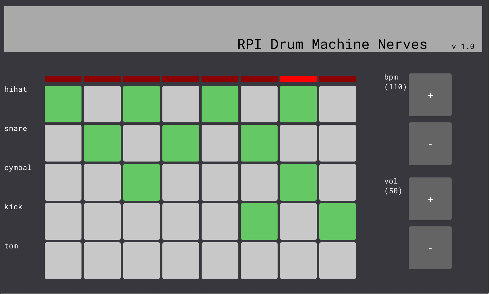

# RPI Drum Machine Nerves

This is a drum machine intended to run on an RPI. I currently have tested this on a RPI 2 B+.

There are some known issues; it won't run with all 4 measures. It works with 1 measure.

## Dependencies

- afplay

Note: I have only tested this on MAC. If you wish you to use a different tool for playing sound look at `lib/audio_player.ex` and change the command in there.

6